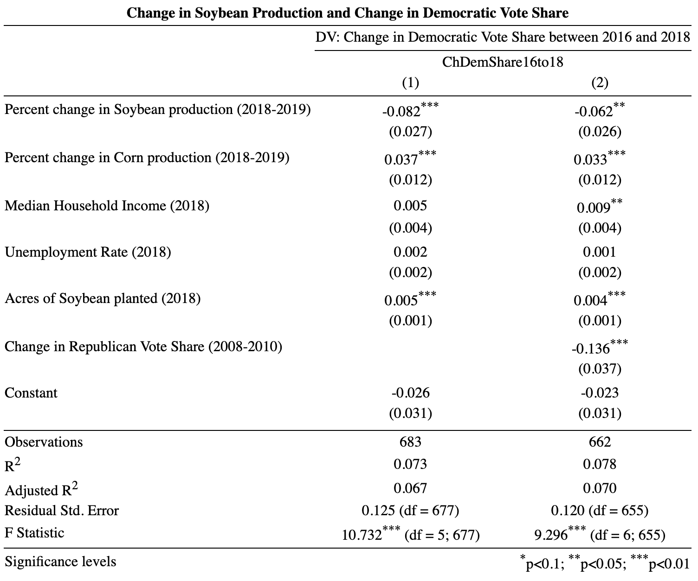

---
output:
  xaringan::moon_reader:
    css: xaringan-themer.css
    nature:
      ratio: 16:9
      seal: false
---
layout: true
background-image: url(https://i.ibb.co/jJ6Bs1w/bbr-logo.png)
background-position: top center
background-size: 7.5%
---
class: middle, center, inverse

```{r xaringan-tile-view, echo = FALSE}
xaringanExtra::use_tile_view()
```

```{r xaringan-animate, echo=FALSE}
#xaringanExtra::use_animate_all("slide_left")
```

```{r xaringan-editable, echo = FALSE}
xaringanExtra::use_editable()
```

```{r xaringan-tachyons, echo = FALSE}
xaringanExtra::use_tachyons()
```


<style type="text/css">
.remark-slide-content {
    font-size: 15px;
    padding: 4em 8em 4em 8em;
}
.my-one-page-font {
  font-size: 14px;
}
.my-large-page-font {
  font-size: 18px;
}
</style>

```{r xaringan-themer, include = FALSE}
library(xaringanthemer)
style_mono_accent(base_color = "#d00000",
                  header_font_google = google_font("Saira Semi Condensed"), #Cinzel, Sacramento, Montserrat, Lora
                  text_font_google   = google_font("Lora", "300", "300i"))

```
# Impact of China's Retaliatory Tariffs on Democratic Vote Share Between 2016 and 2018

.middle[
Bhabishya Neupane | Bureau of Business Research | April 5, 2021
]
---
class: my-large-page-font, middle, left

# Motivation:

On July 6, 2018, President Trump’s administration imposed tariffs on $34 billion worth of Chinese goods, including televisions, aircraft parts, and medical devices. These tariffs were met by swift retaliation from China as they decided to impose tariffs on  agricultural products form the United States. This decision from China had a negative impact on agricultural producers of the United States - especially on the soybean producers, among which support for Trump and the Republican Party tended to be high.

---
class: my-large-page-font, middle, left

#Research Question:

Following China's retaliatory tariffs before the midterm election, were soybean producing counties more likely to see shifts in the vote share toward Democratic candidates?

---


class: my-large-page-font, middle, left

# Method:

- Factors that contribute to the reduction or growth in Change in Democratic Vote Share from 2016 to 2018 is estimated using Ordinary Least Square (OLS) regression.  
  
- Dependent variable is Change in Democratic Vote Share from 2016 to 2018.  
  
- Independent variables include:
  
  1. Percent change in Soybean production from 2018 to 2019
    
  2. Percent change in Corn production from 2018 to 2019
    
  3. Median Household Income in 2018
    
  4. Unemployment Rate in 2018
    
  5. Acres of Soybean planted in 2018

  6. Change in Republican Vote Share from 2008 and 2010
  
---
class: my-large-page-font, middle, left

# Data Sources:

- Data collected are county level.  
  
- Corn and Soybean production and acres planted data comes from United States Department of Agriculture (USDA).  
  
- Election data for House of Representative comes from Secretary of State website from each state secretary’s website.
  
- Our Median Household Income and Unemployment rate data comes from either American Community Survey (ACS) or Bureau of Labor Statistics (BLS).  


---

class: middle, left

# Model:

$ChangeInDemVoteShare$ = $\alpha$ + $\beta_0ChangeInSoyProd$ + $\beta_1ChangeInCornProd$ + $\beta_2MedianHHIncome$ + $\beta_3UnempRate$ + $\beta_4AcresOfSoyPlanted$


$ChangeInDemVoteShare$ = $\alpha$ + $\beta_0ChangeInSoyProd$ + $\beta_1ChangeInCornProd$ + $\beta_2MedianHHIncome$ + $\beta_3UnempRate$ + $\beta_4AcresOfSoyPlanted$ + $\beta_5ChangeInRepVoteShare$


where,  
  
$\alpha$ = intercept  
  
$ChangeInDemVoteShare$ = Change in Democratic Vote Share from 2016 to 2018  
  
$\beta_0ChangeInSoyProd$ = Percent change in Soybean production from 2018 to 2019  
  
$\beta_1ChangeInCornProd$ = Percent change in Corn production from 2018 to 2019  
  
$\beta_2MedianHHIncome$ = Median Household Income in 2018  
  
$\beta_3UnempRate$ = Unemployment Rate in 2018  
  
$\beta_4AcresOfSoyPlanted$ = Acres of Soybean planted in 2018  
  
$\beta_5ChangeInRepVoteShare$ = Change in Republican Vote Share from 2008 to 2010


---
class: middle, center

# Results:

.center[
```{r echo=FALSE, out.width='55%'}
# local

```
]


---

class: my-one-page-font, top, middle

### Predicting Change in Democratic Vote Share from 2016 to 2018


.pull-left[
```{r echo=FALSE, message=FALSE, warning=FALSE, results='asis'}

library(DT)
library(tidyverse)
library(tidymodels)
library(kableExtra)

data <- load("data/data.Rdata")

election_lm <- linear_reg() %>% 
  set_engine("lm") %>% 
  fit(ChDemShare16to18 ~ Ch_soy_18to19+ Ch_corn_18to19 + median_household_income + 
        unemployment_rate+ soybean_acres_planted2018, 
      data = election_reg1)

election_table <- election_reg1 %>%
  add_column(predict(election_lm, new_data = election_reg1)) %>%
  select(state, county, Ch_soy_18to19, .pred) %>%
  rename(
    `% Change in Soybean Production from 2018 to 2019` = Ch_soy_18to19,
    `Predicted Change in Democratic Vote Share from 2016 to 2018` = .pred,
    States = state,
    Counties = county
  )

Nebraska <- election_table %>% 
  filter(States == "Nebraska") %>% 
  filter(Counties == "Kearney")
  
Illinois <- election_table %>% 
  filter(States == "Illinois") %>% 
  filter(Counties == "Knox")

Minnesota <- election_table %>% 
  filter(States == "Minnesota") %>% 
  filter(Counties == "Dodge")

Wisconsin <- election_table %>% 
  filter(States == "Wisconsin") %>% 
  filter(Counties == "Fond Du Lac")

Michigan <- election_table %>% 
  filter(States == "Michigan") %>% 
  filter(Counties == "Washington")

Kansas <- election_table %>% 
  filter(States == "Kansas") %>% 
  filter(Counties == "Montgomery")

Oklahoma <- election_table %>% 
  filter(States == "Oklahoma") %>% 
  filter(Counties == "McClain")

Indiana <- election_table %>% 
  filter(States == "Indiana") %>% 
  filter(Counties == "Huntington")

Ohio <- election_table %>% 
  filter(States == "Ohio") %>% 
  filter(Counties == "Morgan")

Iowa <- election_table %>% 
  filter(States == "Iowa") %>% 
  filter(Counties == "Butler")

election_stateBind <- rbind(Nebraska, Illinois, Iowa, Kansas, Michigan, Minnesota, Ohio, Oklahoma, Wisconsin, Indiana)

election_stateBind %>%
  knitr::kable(format = "html") %>% 
  kable_styling(font_size = 10)

```

__Counties on the table were chosen at random.__


]


.pull-right[


- Plugging in a negative value for Changes in Soybean production into the equation below shows a positive association with Change in Democratic Vote Share from 2016 to 2018.

- This means a decrease in Soybean production from 2018 to 2019 is associated with an increase in Democratic voting.     

$ChangeInDemVoteShare$ = $-0.026$ - $0.082ChangeInSoyProd$ + $0.037ChangeInCornProd$ + $0.005MedianHHIncome$ + $0.002UnempRate$ + $0.005AcresOfSoyPlanted$

]
---
class: my-large-page-font, middle, left

# Limitations:

1. USDA has not reported soybean and corn production data for many counties in 2018 and 2019 which limits the number of observations in the regression model.
 - A follow-up analysis shows that there are no systematic differences between counties with and without missing data.

2. The difference in voter turnout between presidential and midterm elections is not accounted for in the model.   
  
3. Model contains data for 42/50 states, but includes all major agricultural states.


---

class: my-large-page-font, middle, left

# Conclusion:
.can-edit[
1. Changes in Soybean production from 2018 to 2019 had an effect on the Change in Democratic vote share from 2016 to 2018. A decrease in Soybean production from 2018 to 2019 is associated with an increase in Democratic vote share.   
  
2. This effect is slightly reduced when historical voting patterns are controlled for. Historical voting patterns, the control variable, is accounted for by Change in Republican Vote Share from 2008 to 2010 in the model.
  
3. Likewise, when  controlling for historical voting patterns, the median household income was able to explain some of the variance in the dependent variable.
  
5. Lastly, the model is able to explain very little about the variance in change in Democratic Vote Share from 2016 to 2018 since the $R^2$ is very low.
]

---
class: my-large-page-font, center, middle, inverse

# Acknowledgements:

   Dr. Mitch Herian,    
  Project Director,  
  Bureau of Business Research  
  
  
   Dr. Uchechukwu Jarrett,  
  Assistant Professor of Practice in Economics,  
  Department of Economics  

